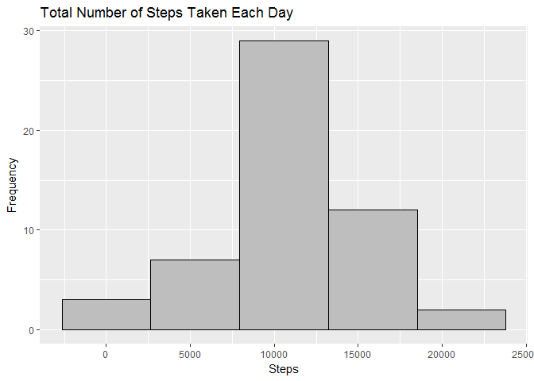
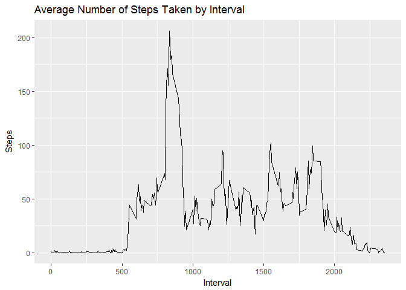
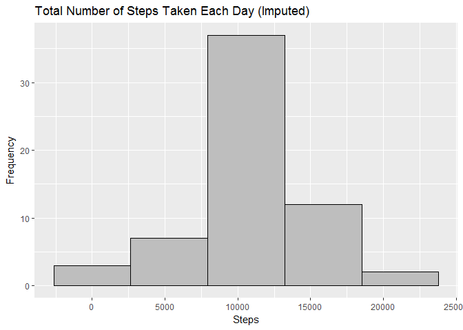
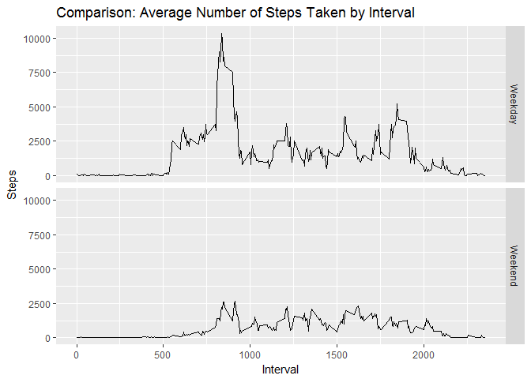

## Loading and preprocessing

At the beginning, we load the data from the provided "activity.csv" file into a data frame ```df```. An additional transformation step is included to transform its data column into the correct format (Date instead of Factor):


```r
download.file("https://d396qusza40orc.cloudfront.net/repdata%2Fdata%2Factivity.zip", destfile = "repdata_data_activity.zip", mode="wb")
unzip("activity.zip")
```

```
## Warning in unzip("activity.zip"): error 1 in extracting from zip file
```

```r
df <- read.csv("activity.csv")
df$date <- as.Date(df$date)
head(df)
```

```
##   steps       date interval
## 1    NA 2012-10-01        0
## 2    NA 2012-10-01        5
## 3    NA 2012-10-01       10
## 4    NA 2012-10-01       15
## 5    NA 2012-10-01       20
## 6    NA 2012-10-01       25
```

## Histogram of the total number of steps taken each day

We create an aggregated data set ```steps_total``` first that summarizes all steps by date. We then use this data set to plot the histogram with ggplot2:


```r
library(dplyr)
library(ggplot2)

steps_total <- df %>% group_by(date) %>% summarise(steps = sum(steps))

g1 <- ggplot(steps_total, aes(steps))
g1 + geom_histogram(bins = 5, col = "black", fill = "grey") + 
    labs(x = "Steps", y = "Frequency", title = "Total Number of Steps Taken Each Day")
```

<!-- -->

## Mean and median number of steps taken each day

Based on ```steps_total```, we calculate the mean and median number of steps taken each day (while instructing R to remove NAs):


```r
mean <- mean(steps_total$steps, na.rm = T)
median <- median(steps_total$steps, na.rm = T)
```

The calculated mean and median figures are:


```r
mean
```

```
## [1] 10766.19
```

```r
median
```

```
## [1] 10765
```

## Time series plot of the average number of steps taken

We create an aggregated data set ```steps_interval``` that averages the number of steps by interval. We then use this data set to plot the line chart representing the time series:


```r
steps_interval <- df %>% group_by(interval) %>% summarise(steps = mean(steps, na.rm = T))

g2 <- ggplot(steps_interval, aes(interval, steps))
g2 + geom_line() + labs(x = "Interval", y = "Steps", title = "Average Number of Steps Taken by Interval")
```

<!-- -->

## The 5-minute interval that, on average, contains the maximum number of steps

To determine the required interval, we utilize the following command to select the record with the maximum value for steps from ```steps_interval``` we created earlier:


```r
max <- steps_interval %>% top_n(1, steps) %>% pull(interval)
```

The wanted interval containing the maximum number of steps is:

```r
max
```

```
## [1] 835
```

## Code to describe and show a strategy for imputing missing data

Our strategy for imputating missing values for steps is to use the mean from the associated 5 minute intervals. The number of missing values is:


```r
missing_total <- sum(is.na(df$steps))
missing_total
```

```
## [1] 2304
```

We create a helper function ```impute()``` which returns the average number of steps for a provided interval x from the data set ```steps_interval``` we created earlier (containing the average number of steps for each interval). The imputation results are inserted into a copy of the original data frame called ```df_imputed```:


```r
impute <- function(x) {
    unlist(steps_interval %>% filter(interval == x) %>% select(steps))
}

df_imputed <- df
for (i in 1:nrow(df_imputed)) {
    if (is.na(df_imputed[i,]$steps)) {
        df_imputed[i,]$steps <- impute(df_imputed[i,]$interval)
    }
}

head(df_imputed)
```

```
##       steps       date interval
## 1 1.7169811 2012-10-01        0
## 2 0.3396226 2012-10-01        5
## 3 0.1320755 2012-10-01       10
## 4 0.1509434 2012-10-01       15
## 5 0.0754717 2012-10-01       20
## 6 2.0943396 2012-10-01       25
```

## Histogram of the total number of steps taken each day after missing values are imputed

We create an aggregated data set ```steps_total_imputed``` first that summarizes all steps by date (including the values from the imputation). We then use this data set to plot the histogram:


```r
steps_total_imputed <- df_imputed %>% group_by(date) %>% summarise(steps = sum(steps))

g3 <- ggplot(steps_total_imputed, aes(steps))
g3 + geom_histogram(bins = 5, col = "black", fill = "grey") + 
    labs(x = "Steps", y = "Frequency", title = "Total Number of Steps Taken Each Day (Imputed)")
```

<!-- -->

Based on ```steps_total_imputed```, we again calculate the mean and median number of steps taken each day after the imputation:


```r
mean_imputed <- mean(steps_total_imputed$steps)
median_imputed <- median(steps_total_imputed$steps)
```

The results are:


```r
mean_imputed
```

```
## [1] 10766.19
```

```r
median_imputed
```

```
## [1] 10766.19
```

As we can, the mean is identical to the previous calculation before the imputation, while the median is slightly higher.

## Panel plot comparing the average number of steps taken per 5-minute interval across weekdays and weekends

To enable a distinction between weekdays and weekends, we need to introduce a new column labelled ```weekdays``` into our data frame which classifies a specific date either as weekday or weekend for all records:


```r
Sys.setlocale("LC_TIME", "English")
```

```
## [1] "English_United States.1252"
```

```r
df_imputed_week <- df_imputed %>% 
    mutate(weekdays = ifelse(weekdays(date) == "Saturday" | weekdays(date) == "Sunday", "Weekend", "Weekday"))
```

Then, we create an aggregated data set ```steps_week_interval``` that gives us the average number of steps by weekdays and interval. We use this data set to create the described panel plot that draws the comparison between weekdays and weekend:


```r
steps_week_interval <- df_imputed_week %>% group_by(interval, weekdays) %>% summarise(steps = sum(steps))

g4 <- ggplot(steps_week_interval, aes(interval, steps))
g4 + geom_line() + facet_grid(weekdays ~.) + 
    labs(x = "Interval", y = "Steps", title = "Comparison: Average Number of Steps Taken by Interval")
```

<!-- -->
